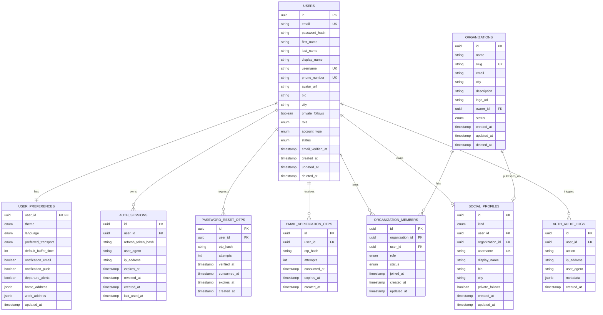
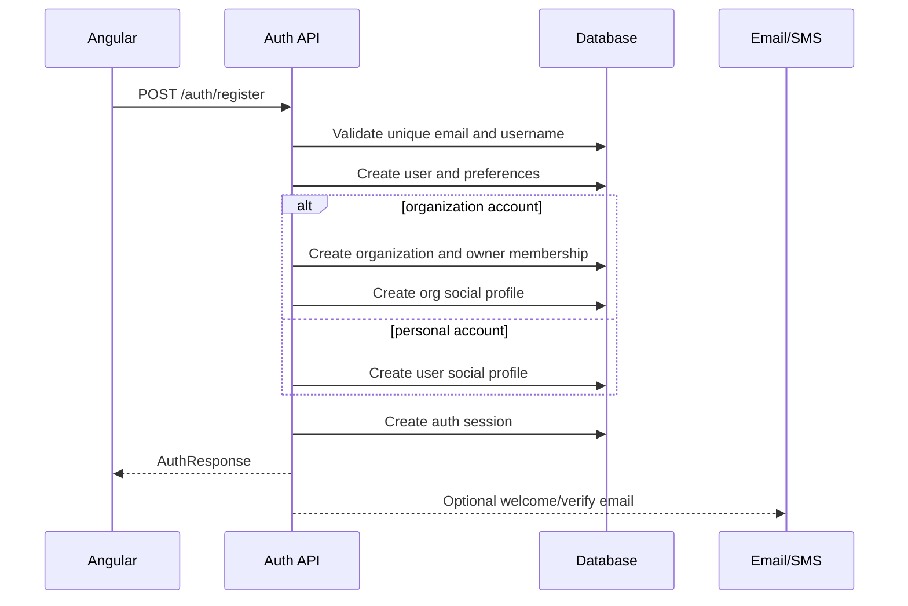
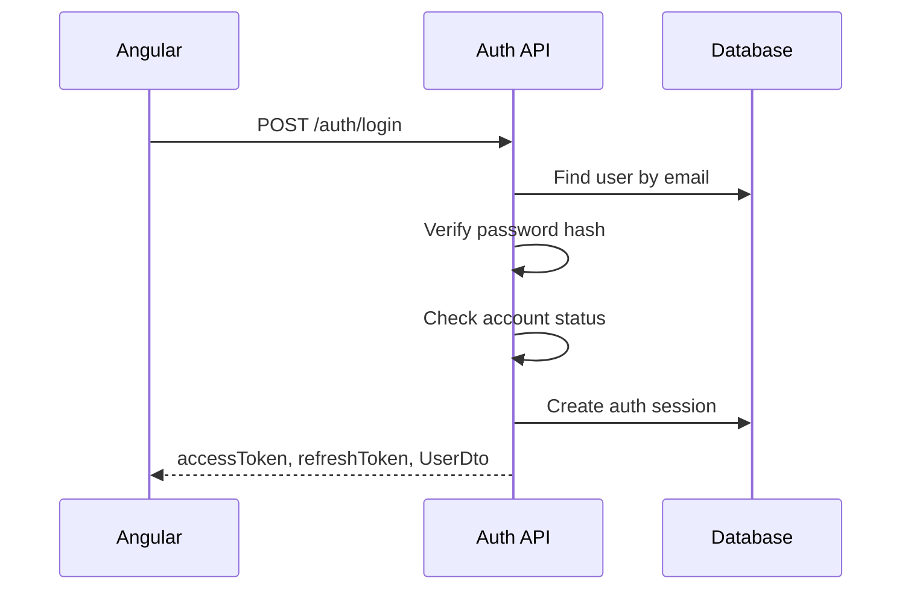
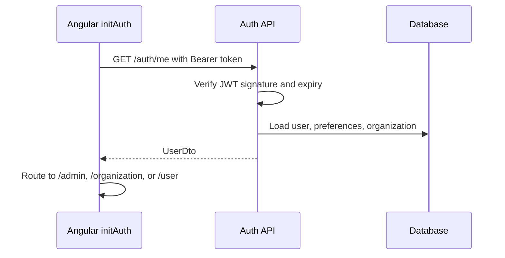
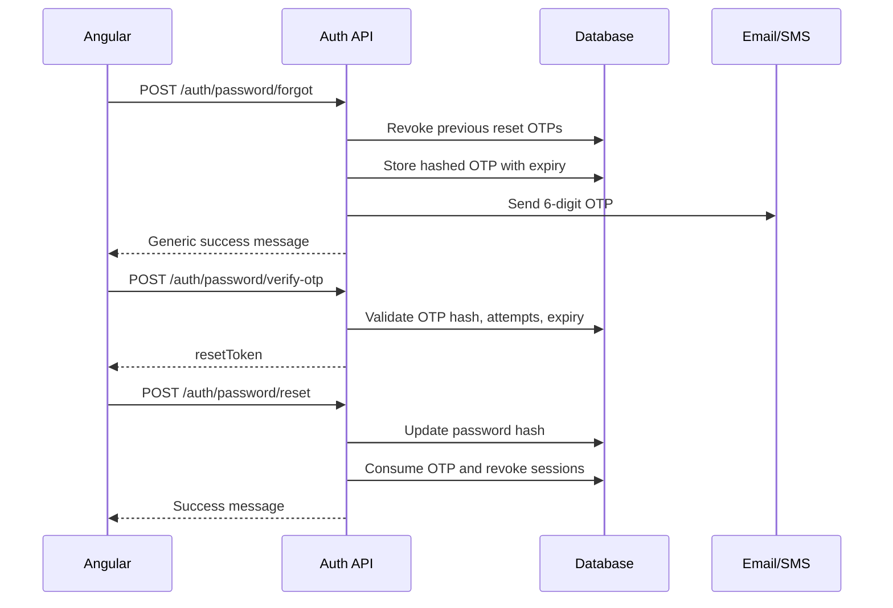

# PlanGo Auth Backend Contract

This document is the backend handoff for the PlanGo authentication flow. It describes the endpoints, data models, validation rules, authorization rules, password reset flow, and database ERD needed to replace the current JSON Server mock in `plango-frontend-2`.

The frontend currently depends on:

- Angular 21
- `authStore`
- `AuthService`
- Bearer token stored at `localStorage.token`
- `IUser.accountType` for routing user vs organization accounts
- `IUser.role` for admin routing

Production backend must not copy the JSON Server behavior exactly. It must implement real authentication, hashed passwords, real JWTs, refresh sessions, OTP expiry, and server-side authorization.

## Current Frontend Routing Rules

After login/signup/bootstrap:

| User state                   | Frontend route  |
| ---------------------------- | --------------- |
| `role = admin`               | `/admin`        |
| `accountType = organization` | `/organization` |
| `accountType = personal`     | `/user`         |
| no valid token               | `/auth/login`   |

Backend must enforce the same rules on protected APIs. Frontend guards are only UX protection.

## API Conventions

Base URL:

```txt
/api/v1
```

Auth header:

```http
Authorization: Bearer <accessToken>
```

Success envelope:

```ts
type ApiSuccess<T> = {
  data: T;
  message?: string;
};
```

Error envelope:

```ts
type ApiError = {
  error: {
    code: string;
    message: string;
    fields?: Record<string, string[]>;
    requestId?: string;
  };
};
```

Dates must be ISO strings:

```txt
2026-05-16T10:30:00.000Z
```

## Core DTOs

### AuthResponse

```ts
type AuthResponse = {
  accessToken: string;
  refreshToken: string;
  expiresIn: number;
  tokenType: 'Bearer';
  user: UserDto;
  organization?: OrganizationDto | null;
};
```

### UserDto

```ts
type AccountType = 'personal' | 'organization';
type UserRole = 'user' | 'admin';
type AccountStatus = 'active' | 'inactive' | 'suspended';

type UserDto = {
  id: string;
  email: string;
  firstName: string;
  lastName: string;
  displayName: string;
  userName: string;
  phoneNumber?: string;
  avatarUrl?: string;
  bio?: string;
  city?: string;
  privateFollows?: boolean;
  role: UserRole;
  accountType: AccountType;
  organizationId?: string;
  organizationRole?: 'owner' | 'member';
  organizationName?: string;
  organizationDescription?: string;
  status: AccountStatus;
  createdAt: string;
  updatedAt: string;
  preferences: UserPreferencesDto;
};
```

### UserPreferencesDto

```ts
type UserPreferencesDto = {
  theme: 'light' | 'dark' | 'system';
  language: 'ar' | 'en';
  preferredTransport: 'car' | 'walking' | 'cycling' | 'public_transport';
  defaultBufferTime: number;
  homeAddress?: LocationDto;
  workAddress?: LocationDto;
  notifications: {
    email: boolean;
    push: boolean;
    departureAlerts: boolean;
  };
};

type LocationDto = {
  address: string;
  latitude: number;
  longitude: number;
  placeId?: string;
};
```

### OrganizationDto

```ts
type OrganizationDto = {
  id: string;
  name: string;
  slug: string;
  email: string;
  city?: string;
  description?: string;
  logoUrl?: string;
  ownerId: string;
  membersCount: number;
  status: 'active' | 'inactive' | 'pending';
  createdAt: string;
  updatedAt: string;
};
```

Never return these fields to the frontend:

```txt
password
passwordHash
refreshTokenHash
resetOtpHash
emailVerificationOtpHash
```

## Endpoints

## 1. Register

```http
POST /api/v1/auth/register
```

Creates either:

- a personal account
- an organization owner account

This endpoint must also create the matching social profile because org/user feed and follow pages depend on it.

Request:

```json
{
  "accountType": "organization",
  "firstName": "PlanGo",
  "lastName": "",
  "displayName": "PlanGo Org",
  "username": "plango_org",
  "email": "org@plango.com",
  "phoneNumber": "01055555555",
  "password": "12345678",
  "city": "Cairo",
  "bio": "Smart event and departure planning.",
  "privateFollows": false,
  "organizationName": "PlanGo Org",
  "organizationDescription": "Smart event and departure planning.",
  "preferences": {
    "googleCalendarSync": false,
    "notifications": true,
    "locationTracking": true
  }
}
```

Validation:

| Field                       | Rule                                                   |
| --------------------------- | ------------------------------------------------------ |
| `accountType`               | required, `personal` or `organization`                 |
| `displayName`               | required, 2-80 chars                                   |
| `username`                  | required, unique, lowercase, regex `^[a-z0-9_]{3,24}$` |
| `email`                     | required, unique, valid email                          |
| `phoneNumber`               | required; unique if phone login is supported           |
| `password`                  | required, minimum 8 chars in production                |
| `organizationName`          | required when `accountType = organization`             |
| `privateFollows`            | optional, default `false`                              |
| `preferences.notifications` | maps to `preferences.notifications.push`               |

Backend defaults:

```json
{
  "role": "user",
  "status": "active",
  "preferences": {
    "theme": "dark",
    "language": "ar",
    "preferredTransport": "car",
    "defaultBufferTime": 15,
    "notifications": {
      "email": true,
      "push": true,
      "departureAlerts": true
    }
  }
}
```

Organization signup must be atomic. If any insert fails, rollback all:

1. Create `users`
2. Create `user_preferences`
3. Create `organizations`
4. Create `organization_members` with role `owner`
5. Create `social_profiles` with `kind = org`
6. Create `auth_sessions`

Personal signup must:

1. Create `users`
2. Create `user_preferences`
3. Create `social_profiles` with `kind = user`
4. Create `auth_sessions`

Response `201`:

```json
{
  "data": {
    "accessToken": "jwt.access.token",
    "refreshToken": "opaque-refresh-token",
    "expiresIn": 3600,
    "tokenType": "Bearer",
    "user": {
      "id": "usr_123",
      "email": "org@plango.com",
      "firstName": "PlanGo",
      "lastName": "",
      "displayName": "PlanGo Org",
      "userName": "plango_org",
      "phoneNumber": "01055555555",
      "role": "user",
      "accountType": "organization",
      "organizationId": "org_123",
      "organizationRole": "owner",
      "organizationName": "PlanGo Org",
      "organizationDescription": "Smart event and departure planning.",
      "status": "active",
      "createdAt": "2026-05-16T10:00:00.000Z",
      "updatedAt": "2026-05-16T10:00:00.000Z",
      "preferences": {
        "theme": "dark",
        "language": "ar",
        "preferredTransport": "car",
        "defaultBufferTime": 15,
        "notifications": {
          "email": true,
          "push": true,
          "departureAlerts": true
        }
      }
    },
    "organization": {
      "id": "org_123",
      "name": "PlanGo Org",
      "slug": "plango_org",
      "email": "org@plango.com",
      "city": "Cairo",
      "description": "Smart event and departure planning.",
      "ownerId": "usr_123",
      "membersCount": 1,
      "status": "active",
      "createdAt": "2026-05-16T10:00:00.000Z",
      "updatedAt": "2026-05-16T10:00:00.000Z"
    }
  }
}
```

Errors:

| Status | Code                      |
| ------ | ------------------------- |
| `400`  | `VALIDATION_ERROR`        |
| `409`  | `EMAIL_ALREADY_EXISTS`    |
| `409`  | `USERNAME_ALREADY_EXISTS` |
| `409`  | `PHONE_ALREADY_EXISTS`    |
| `429`  | `RATE_LIMITED`            |

## 2. Login

```http
POST /api/v1/auth/login
```

Request:

```json
{
  "email": "org@plango.com",
  "password": "12345678"
}
```

Rules:

- Match email case-insensitively.
- Verify password against password hash.
- Reject suspended/inactive accounts.
- Create an auth session.
- Return safe `UserDto`.

Response `200`:

```json
{
  "data": {
    "accessToken": "jwt.access.token",
    "refreshToken": "opaque-refresh-token",
    "expiresIn": 3600,
    "tokenType": "Bearer",
    "user": {
      "id": "usr_123",
      "email": "org@plango.com",
      "firstName": "PlanGo",
      "lastName": "",
      "displayName": "PlanGo Org",
      "userName": "plango_org",
      "role": "user",
      "accountType": "organization",
      "organizationId": "org_123",
      "organizationRole": "owner",
      "organizationName": "PlanGo Org",
      "organizationDescription": "Smart event and departure planning.",
      "status": "active",
      "createdAt": "2026-05-16T10:00:00.000Z",
      "updatedAt": "2026-05-16T10:00:00.000Z",
      "preferences": {
        "theme": "dark",
        "language": "ar",
        "preferredTransport": "car",
        "defaultBufferTime": 15,
        "notifications": {
          "email": true,
          "push": true,
          "departureAlerts": true
        }
      }
    }
  }
}
```

Errors:

| Status | Code                  |
| ------ | --------------------- |
| `401`  | `INVALID_CREDENTIALS` |
| `403`  | `ACCOUNT_SUSPENDED`   |
| `403`  | `ACCOUNT_INACTIVE`    |
| `429`  | `RATE_LIMITED`        |

## 3. Get Current User

```http
GET /api/v1/auth/me
Authorization: Bearer <accessToken>
```

Used by frontend `initAuth()` when app starts with a saved token.

Response `200`:

```json
{
  "data": {
    "user": {
      "id": "usr_123",
      "email": "org@plango.com",
      "firstName": "PlanGo",
      "lastName": "",
      "displayName": "PlanGo Org",
      "userName": "plango_org",
      "role": "user",
      "accountType": "organization",
      "organizationId": "org_123",
      "organizationRole": "owner",
      "organizationName": "PlanGo Org",
      "organizationDescription": "Smart event and departure planning.",
      "status": "active",
      "createdAt": "2026-05-16T10:00:00.000Z",
      "updatedAt": "2026-05-16T10:00:00.000Z",
      "preferences": {
        "theme": "dark",
        "language": "ar",
        "preferredTransport": "car",
        "defaultBufferTime": 15,
        "notifications": {
          "email": true,
          "push": true,
          "departureAlerts": true
        }
      }
    },
    "organization": {
      "id": "org_123",
      "name": "PlanGo Org",
      "slug": "plango_org",
      "email": "org@plango.com",
      "ownerId": "usr_123",
      "membersCount": 1,
      "status": "active",
      "createdAt": "2026-05-16T10:00:00.000Z",
      "updatedAt": "2026-05-16T10:00:00.000Z"
    }
  }
}
```

Errors:

| Status | Code                |
| ------ | ------------------- |
| `401`  | `TOKEN_MISSING`     |
| `401`  | `TOKEN_EXPIRED`     |
| `401`  | `TOKEN_INVALID`     |
| `403`  | `ACCOUNT_SUSPENDED` |
| `404`  | `USER_NOT_FOUND`    |

## 4. Refresh Token

```http
POST /api/v1/auth/refresh
```

Request:

```json
{
  "refreshToken": "opaque-refresh-token"
}
```

Rules:

- Store only a hash of the refresh token.
- Rotate refresh tokens every time.
- Revoke old refresh token after successful rotation.
- Reject revoked/expired sessions.

Response `200`:

```json
{
  "data": {
    "accessToken": "new.jwt.access.token",
    "refreshToken": "new-opaque-refresh-token",
    "expiresIn": 3600,
    "tokenType": "Bearer"
  }
}
```

Errors:

| Status | Code                    |
| ------ | ----------------------- |
| `401`  | `REFRESH_TOKEN_INVALID` |
| `401`  | `REFRESH_TOKEN_EXPIRED` |
| `403`  | `SESSION_REVOKED`       |

## 5. Logout Current Session

```http
POST /api/v1/auth/logout
Authorization: Bearer <accessToken>
```

Request:

```json
{
  "refreshToken": "opaque-refresh-token"
}
```

Response `200`:

```json
{
  "data": {
    "message": "Logged out successfully"
  }
}
```

## 6. Logout All Sessions

```http
POST /api/v1/auth/logout-all
Authorization: Bearer <accessToken>
```

Revokes every active session for the current user.

Response `200`:

```json
{
  "data": {
    "message": "All sessions revoked"
  }
}
```

## 7. Check Email/Username Availability

```http
GET /api/v1/auth/availability?email=user@example.com&username=nader_123
```

Response `200`:

```json
{
  "data": {
    "email": {
      "available": true
    },
    "username": {
      "available": false,
      "reason": "USERNAME_ALREADY_EXISTS"
    }
  }
}
```

## 8. Request Password Reset OTP

```http
POST /api/v1/auth/password/forgot
```

Request:

```json
{
  "email": "user@plango.com"
}
```

Rules:

- Generate 6 numeric digits.
- Store only OTP hash.
- OTP expires after 10 minutes.
- Revoke previous unused OTPs for the same user.
- Rate limit by IP and email.
- In production, do not reveal if email exists.

Response `200`:

```json
{
  "data": {
    "message": "If this email exists, a verification code has been sent.",
    "expiresIn": 600
  }
}
```

## 9. Verify Password Reset OTP

```http
POST /api/v1/auth/password/verify-otp
```

Request:

```json
{
  "email": "user@plango.com",
  "otp": "123456"
}
```

Rules:

- Max 5 failed attempts per OTP.
- Reject expired/consumed OTPs.
- Mark OTP as verified on success.
- Return a short-lived reset token.

Response `200`:

```json
{
  "data": {
    "message": "OTP verified successfully",
    "resetToken": "short-lived-reset-token",
    "expiresIn": 600
  }
}
```

Errors:

| Status | Code                    |
| ------ | ----------------------- |
| `400`  | `OTP_INVALID`           |
| `400`  | `OTP_EXPIRED`           |
| `429`  | `OTP_ATTEMPTS_EXCEEDED` |

## 10. Reset Password

```http
POST /api/v1/auth/password/reset
```

Preferred production request:

```json
{
  "email": "user@plango.com",
  "resetToken": "short-lived-reset-token",
  "newPassword": "newStrongPassword123"
}
```

Temporary compatibility request if frontend still sends OTP directly:

```json
{
  "email": "user@plango.com",
  "otp": "123456",
  "newPassword": "newStrongPassword123"
}
```

Rules:

- Hash new password with Argon2id or bcrypt.
- Mark OTP/reset token as consumed.
- Revoke all active refresh sessions for the user.
- Reject weak password.

Response `200`:

```json
{
  "data": {
    "message": "Password changed successfully"
  }
}
```

## 11. Update Current User

```http
PATCH /api/v1/users/me
Authorization: Bearer <accessToken>
```

Used by user settings and organization settings.

Request:

```json
{
  "displayName": "PlanGo Org",
  "userName": "plango_org",
  "bio": "Updated description",
  "city": "Cairo",
  "privateFollows": false,
  "email": "hello@plango.com",
  "organizationName": "PlanGo Org",
  "organizationDescription": "Updated description",
  "preferences": {
    "theme": "dark",
    "language": "ar",
    "preferredTransport": "car",
    "defaultBufferTime": 20,
    "notifications": {
      "email": true,
      "push": true,
      "departureAlerts": true
    }
  }
}
```

Rules:

- `userName` must remain unique.
- `email` must remain unique.
- Update `social_profiles` when `displayName`, `userName`, `bio`, `city`, or `privateFollows` changes.
- Organization owners can update `organizations.name`, `organizations.slug`, and `organizations.description`.
- Non-owners cannot update organization identity fields.

Response `200`:

```json
{
  "data": {
    "user": "UserDto"
  }
}
```

## 12. Update Password While Logged In

```http
PATCH /api/v1/users/me/password
Authorization: Bearer <accessToken>
```

Request:

```json
{
  "currentPassword": "oldPassword",
  "newPassword": "newPassword123"
}
```

Response `200`:

```json
{
  "data": {
    "message": "Password updated successfully"
  }
}
```

## 13. Request Email Verification

```http
POST /api/v1/auth/email/verification/request
Authorization: Bearer <accessToken>
```

Response `200`:

```json
{
  "data": {
    "message": "Verification code sent",
    "expiresIn": 600
  }
}
```

## 14. Verify Email

```http
POST /api/v1/auth/email/verification/confirm
Authorization: Bearer <accessToken>
```

Request:

```json
{
  "otp": "123456"
}
```

Response `200`:

```json
{
  "data": {
    "message": "Email verified successfully"
  }
}
```

## JWT Claims

Access token claims should include:

```json
{
  "sub": "usr_123",
  "email": "org@plango.com",
  "role": "user",
  "accountType": "organization",
  "organizationId": "org_123",
  "organizationRole": "owner",
  "status": "active",
  "iat": 1778935200,
  "exp": 1778938800,
  "jti": "jwt_id"
}
```

Access token lifetime:

```txt
15-60 minutes. Current frontend expects expiresIn = 3600.
```

Refresh token lifetime:

```txt
7-30 days.
```

## Authorization Rules

| Backend area          | Required server-side rule                                              |
| --------------------- | ---------------------------------------------------------------------- |
| Admin APIs            | authenticated and `role = admin`                                       |
| Organization APIs     | authenticated, `accountType = organization`, active org membership     |
| Personal user APIs    | authenticated active personal user, unless endpoint supports org users |
| User settings         | user can update only self                                              |
| Organization settings | only organization owner/admin can update org identity                  |
| Password update       | user can update only own password                                      |
| Password reset        | valid reset token or valid OTP                                         |

## ERD



## Auth Flow Diagrams

### Signup



### Login



### App Bootstrap



### Password Reset



## Database Constraints

Required unique constraints:

```sql
unique(users.email)
unique(users.username)
unique(users.phone_number) -- optional partial unique if phone can be null
unique(organizations.slug)
unique(social_profiles.username)
unique(user_preferences.user_id)
unique(organization_members.organization_id, organization_members.user_id)
```

Recommended indexes:

```sql
index(users.email)
index(users.username)
index(users.account_type, users.status)
index(auth_sessions.user_id, auth_sessions.expires_at)
index(password_reset_otps.user_id, password_reset_otps.expires_at)
index(organization_members.user_id)
index(organization_members.organization_id)
```

## Security Requirements

- Store passwords with Argon2id or bcrypt.
- Never store or return plain passwords.
- Store refresh tokens hashed.
- Rotate refresh tokens on every refresh.
- Rate limit login, signup, OTP request, OTP verification, and reset password.
- Revoke all sessions after password reset.
- Enforce `users.status` on every authenticated request.
- Validate email and username server-side.
- Use generic password reset messages in production.
- Log auth events in `auth_audit_logs`.

Audit actions:

```txt
login_success
login_failed
logout
logout_all
refresh_token
signup
password_reset_requested
password_reset_verified
password_changed
email_verification_requested
email_verified
account_suspended
```

## Frontend Integration Notes

Current mock service uses JSON Server:

```txt
GET /users
POST /users
GET /users/:id
PATCH /users/:id
```

Production frontend should switch to:

```txt
POST /auth/login
POST /auth/register
GET /auth/me
POST /auth/refresh
POST /auth/logout
POST /auth/password/forgot
POST /auth/password/verify-otp
POST /auth/password/reset
PATCH /users/me
```

The frontend currently stores:

```txt
localStorage.token
```

Backend responses must keep these fields complete because routing and UI depend on them immediately:

```txt
user.id
user.email
user.displayName
user.userName
user.role
user.accountType
user.organizationId
user.organizationRole
user.organizationName
user.organizationDescription
user.status
user.preferences
```

## Acceptance Checklist

- Register supports both personal and organization accounts.
- Organization register creates user, organization, owner membership, and social profile atomically.
- Login returns safe `UserDto`, access token, refresh token, and `expiresIn`.
- `GET /auth/me` works from bearer token.
- Refresh tokens are hashed, rotated, and revocable.
- Password reset OTPs are hashed, expiring, rate-limited, and attempt-limited.
- Password reset revokes all active sessions.
- User update syncs `users`, `organizations`, and `social_profiles` where needed.
- Server enforces admin/user/org authorization.
- No endpoint returns password or password hash.
